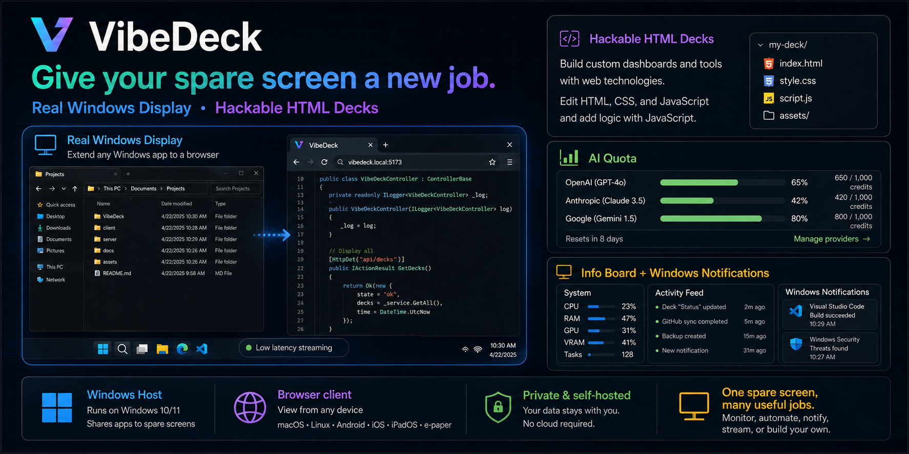
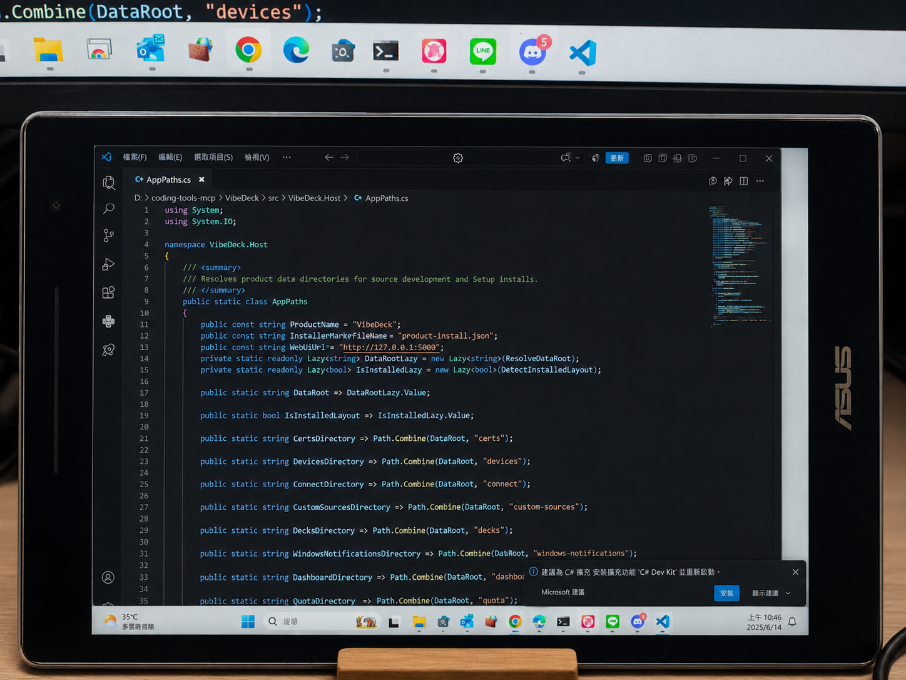
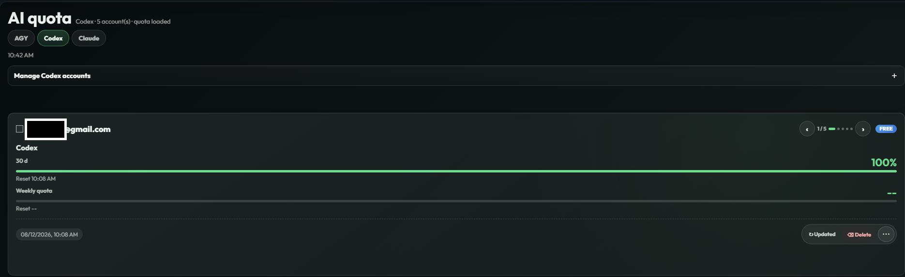
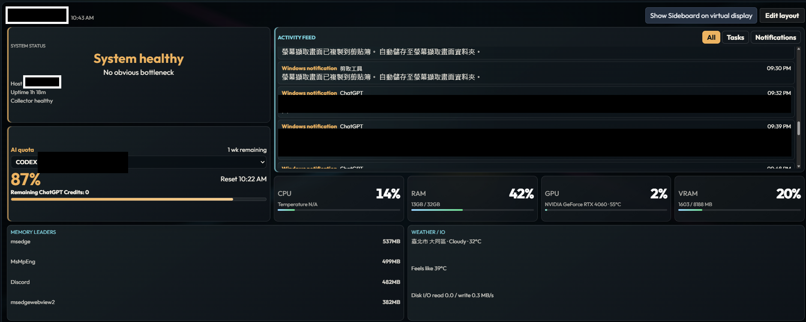
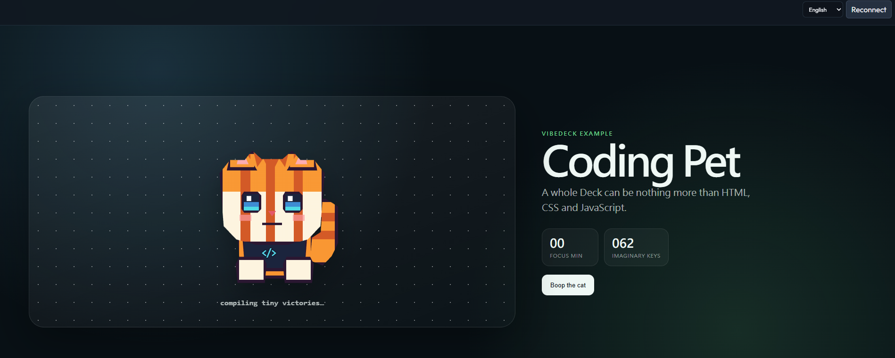
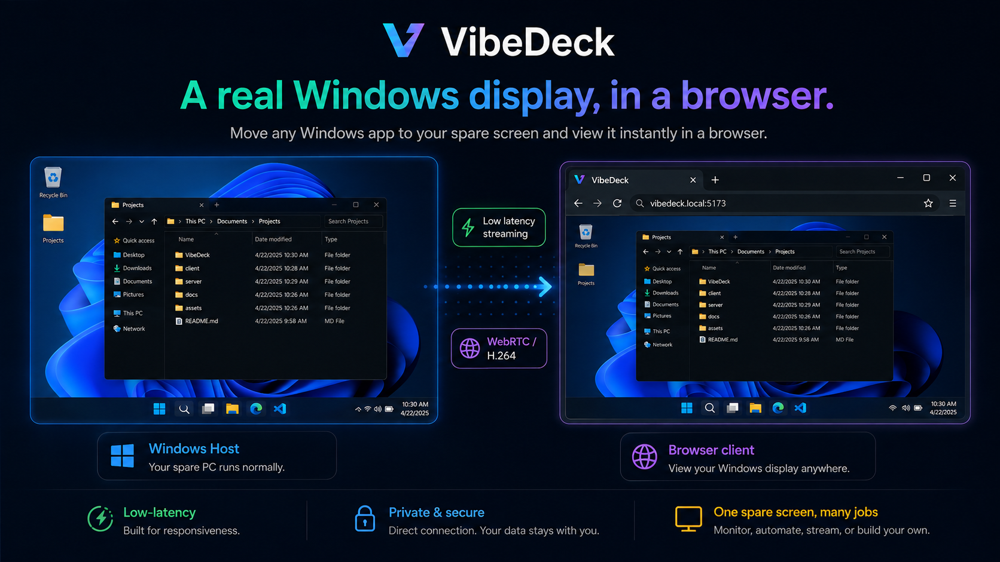
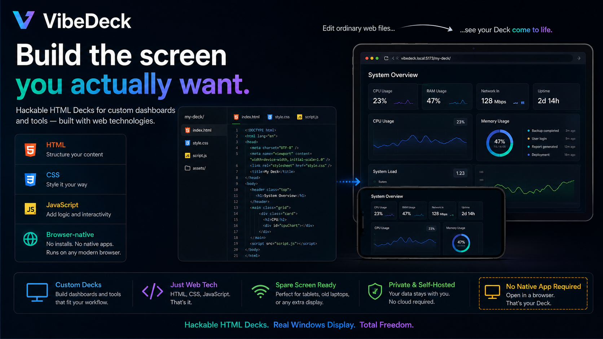

# VibeDeck

**English** · [繁體中文](README.zh-TW.md)



> **Give your spare screen a new job.**
>
> VibeDeck turns an old phone, tablet, laptop, e-paper device, or other browser-capable screen into either a **real Windows display** or a **browser-native custom Deck**.
>
> **Host: Windows 10/11 · Client: modern browser · No client app required.**

**[Download the latest Windows release](https://github.com/mabyes1/VibeDeck/releases/latest)** · [Build from source](#build-from-source)

## What VibeDeck does

VibeDeck gives one spare screen two very different jobs:

| | |
|---|---|
| **Real Windows Display** | Move normal Windows applications onto the spare device. VibeDeck captures a Windows display, streams it over WebRTC, and relays input back to the PC. |
| **Custom HTML Decks** | Run purpose-built HTML, CSS, and JavaScript directly in the device browser at its native resolution. |
| **Glanceable built-in views** | Keep AI quota, system state, tasks, activity, and Windows notifications nearby without taking over a desktop monitor. |

The same device can switch between Display and Deck views. Use Windows pixels when you need a real desktop application; use browser-native rendering when a small-screen interface makes more sense.

## Real product captures

These are captures from the actual VibeDeck product and hardware, not UI mockups. Account and notification details are redacted where needed.

<table>
  <tr>
    <td width="50%"></td>
    <td width="50%"></td>
  </tr>
  <tr>
    <td align="center"><sub><b>Real Windows display on spare hardware</b></sub></td>
    <td align="center"><sub><b>Live AI quota view</b></sub></td>
  </tr>
  <tr>
    <td width="50%"></td>
    <td width="50%"></td>
  </tr>
  <tr>
    <td align="center"><sub><b>System state, activity and Windows notifications</b></sub></td>
    <td align="center"><sub><b>A browser-native custom Deck</b></sub></td>
  </tr>
</table>

## Real Windows apps on a spare screen

Display mode gives the browser device a real Windows display to show. Normal Windows applications can be moved onto it just like another monitor.



Useful for:

- putting a desktop app on a dedicated small screen
- dashboards that already exist as Windows software
- temporary second-display workflows
- devices where installing a native client would be annoying or impossible

## Build the screen you actually want

A Deck is ordinary HTML, CSS, and JavaScript rendered directly by the device browser.

**If it can be a webpage, it can be a Deck.**

Decks avoid video encoding, stay sharp at the device's native resolution, and can reflow for phones, tablets, or e-paper screens. VibeDeck discovers valid Deck folders automatically.



VibeDeck ships with a few useful examples:

- **Sideboard** for CPU, GPU, memory, activity, tasks, AI quota, and Windows notification history
- **Quota** for focused AI usage and account quota views
- **Coding Pet** as a small custom Deck example
- **Remote access** for reaching a trusted Host outside the local network

Use them, modify your own Decks, or ignore the built-in views completely.

## Build your own Deck

Custom Decks live under:

```text
C:\ProgramData\VibeDeck\Decks\<deck-id>\
```

A minimal Deck looks like this:

```text
my-deck/
├─ deck.json
├─ index.html
├─ style.css
└─ app.js
```

Example `deck.json`:

```json
{
  "name": "My Deck",
  "entry": "index.html",
  "icon": "✨"
}
```

VibeDeck discovers valid Deck folders automatically, and a Deck itself has no build step. Static Decks run inside a `sandbox="allow-scripts"` iframe, so they must not assume they are same-origin with the VibeDeck shell or directly call protected Host APIs. Host-provided Deck data uses the read-only Deck Bridge and `/api/deck-data/*` contract. See `docs/custom-decks.md` for the precise sandbox, data-access and fullscreen rules. The bundled `src/VibeDeck.Host/DeckExamples/coding-pet/` is a plain front-end example. `docs/custom-data-sources-spec.md` describes a separate push-data/card model rather than the Custom Deck runtime.

## Quick start

### Windows setup

Download the latest published Windows Setup from the **[GitHub Releases page](https://github.com/mabyes1/VibeDeck/releases/latest)**:

```text
VibeDeck-Setup-<version>.exe
```

Install it from the signed-in Windows desktop. Persistent machine data is stored under:

```text
C:\ProgramData\VibeDeck
```

Open VibeDeck on the PC and follow the connection flow on the spare device. Local discovery starts over HTTP and upgrades the device to HTTPS for normal use.

> **Windows signing note:** current public builds are not yet Authenticode-signed, so Windows may show an unknown-publisher / SmartScreen warning. Release assets include a SHA-256 checksum for integrity verification.

### Build from source

Requirements:

- Windows 10/11
- .NET 8 SDK
- Node.js for browser/Worker tests
- Inno Setup 6 when building the Windows installer

Restore and validate:

```powershell
dotnet restore VibeDeck.sln
dotnet build VibeDeck.sln -c Release --no-restore
pwsh scripts/test-product-flow.ps1 -Source
```

Build the Windows Setup package:

```powershell
pwsh scripts/package-windows-setup.ps1
```

## How it works

VibeDeck has two rendering paths:

```text
Display / Pixel Path
Windows app
   ↓
Windows display
   ↓
capture + H.264/WebRTC
   ↓
browser

Deck / DOM Path
Deck HTML/CSS/JS
   + Host data/events
   ↓
browser-native rendering
```

The Windows Host owns display discovery, streaming, pairing, device trust, Deck discovery, local data services, and optional remote connectivity. The secondary device only needs the browser UI.

For deeper architecture notes, see:

- `docs/product-architecture.md`
- `docs/host-endpoint-architecture.md`
- `docs/windows-virtual-display.md`
- `docs/remote-desktop-streaming.md`
- `docs/https-onboarding.md`

## Security and privacy

The Windows Host remains the local authority.

- Devices pair before receiving trusted APIs.
- Device credentials are scoped to VibeDeck and can be revoked.
- Sensitive local state is stored under `%ProgramData%\VibeDeck` with Windows ACL protection.
- Remote routing does not grant pairing authority to the cloud path.
- The Host uses HTTPS for normal mobile/PWA operation.

Security behavior and trust boundaries are covered by the automated product-flow and security tests in `tests/VibeDeck.Host.Tests/`.

## Why I built it

I kept seeing small PC displays made for temperatures and system stats. They looked useful, but what I actually wanted was not another piece of hardware. I wanted somewhere to put information that was worth glancing at but not worth occupying a main monitor.

The same problem kept showing up elsewhere. Coding agents sometimes sit waiting for approval. AI quota is useful to know without opening another app. GPU temperature matters while gaming, but not enough to live on the main display. Windows notifications are useful precisely when they can stay out of the way.

There was already an old phone on my desk doing almost nothing.

That became the basic idea behind VibeDeck: **use the screens you already own, and give them a useful job.**

## Development

The main solution is:

```text
VibeDeck.sln
```

Important paths:

```text
src/VibeDeck.Host/          Windows Host + browser UI
tests/VibeDeck.Host.Tests/ .NET tests
tests/wwwroot/              browser module tests
driver/VibeDeck.Idd/        experimental VibeDeck IDD development line
packaging/windows-setup/    Windows Setup packaging
scripts/                    build, install, validation, and release tooling
docs/                       architecture and product documentation
```

The production installer currently uses the upstream **Virtual Display Driver** integration. `driver/VibeDeck.Idd/` is a separate development line and is not silently substituted into the production Setup path.

## Feedback and issues

Found a bug, a device-specific problem, or a useful new job for a spare screen? Open a GitHub Issue.

VibeDeck is primarily maintained through direct project development rather than an open pull-request queue. If you have an implementation idea, start with an Issue so the use case can be discussed first. See [`CONTRIBUTING.md`](CONTRIBUTING.md) for the current contribution workflow.

## Roadmap

Current priorities:

1. lower Display latency and improve resilience
2. make Decks easier to author, share, and compose
3. make switching between Display and Deck feel native on the same device
4. keep improving phone, tablet, and e-paper behavior without platform-specific client apps

## License

VibeDeck is source-visible under the **PolyForm Shield License 1.0.0**. You may use, modify, and redistribute the software for permitted purposes, but you may not use it to provide a product that competes with VibeDeck. See [`LICENSE`](LICENSE) for the actual terms.

Third-party components remain under their own licenses and are documented in [`THIRD_PARTY_NOTICES.md`](THIRD_PARTY_NOTICES.md).
