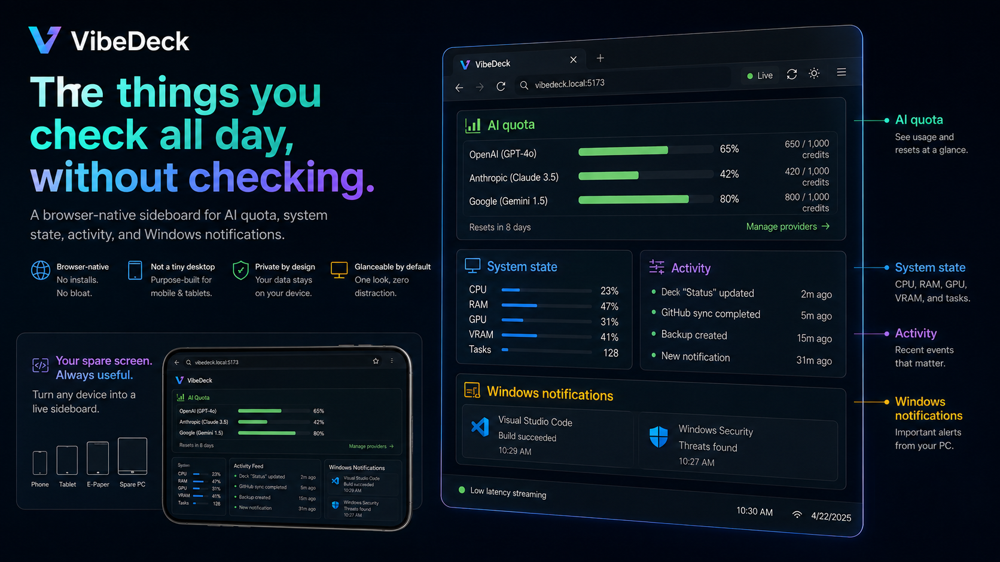

# VibeDeck

**English** · [繁體中文](README.zh-TW.md)


> **Give your spare screen a new job.**
>
> A Windows Host that turns a spare browser-capable screen into a **real Windows display** or a **browser-native, hackable Deck**.
>
> **Host: Windows 10/11 · Client: modern browser · No client app required.**

**[Download the latest Windows release](https://github.com/mabyes1/VibeDeck/releases/latest)** · [Build from source](#build-from-source)

VibeDeck is a Windows host for spare phones, tablets, e-paper devices, laptops, and other browser-capable screens. It has two distinct paths that can share the same device:

- **Display** renders an actual Windows display over the network.
- **Deck** renders purpose-built HTML/CSS/JS directly in the device browser.

Those two rendering paths can power very different jobs. Out of the box, VibeDeck can be a real Windows display, a custom HTML Deck, an AI quota monitor, or a system information board with Windows notifications.

## Four useful jobs. One spare screen.

| | What it does |
|---|---|
| **Real Windows Display** | Put an actual Windows application on the spare screen. VibeDeck uses a real Windows display, streams it over WebRTC, and relays input back to Windows. |
| **Hackable HTML Decks** | Drop in `index.html`, CSS, and JavaScript to build a purpose-made interface that renders natively in the device browser. |
| **AI Quota at a glance** | Keep Codex, Claude, AGY, reset times, percentages, and remaining credits visible without opening another app. |
| **Info Board + Windows Notifications** | See CPU, RAM, GPU, VRAM, activity, tasks, and desktop notifications together on a glanceable second screen. |

The result is not just screen mirroring and not just a dashboard. It is a small-screen runtime where Windows pixels and browser-native interfaces can coexist on the same device.

## Real Windows applications, not a fake monitor

Use a spare device as a real Windows display. VibeDeck creates or discovers a Windows display, captures it, streams it to the browser, and relays input back to Windows. Normal Windows applications can be moved onto that display just like any other monitor.


Good for:

- putting a normal Windows app on a dedicated small screen
- dashboards that already exist as desktop software
- temporary second-display workflows
- devices where installing a native client would be annoying or impossible

## One glance for quota, system state, and notifications

The built-in information board is designed for the things that are useful precisely because they stay visible: AI quota, machine telemetry, activity, tasks, and Windows notifications from the optional notification companion.



This is deliberately different from shrinking a desktop dashboard onto a small screen. The browser-native layout can reflow for phones, tablets, and e-paper devices while keeping the important numbers readable.

## Build the screen you actually want

Run a browser-native experience directly on the spare screen. A Deck is simply a folder with a manifest plus normal web files.

**If it can be a webpage, it can be a Deck.**

Decks avoid video encoding entirely, stay sharp at the device's native resolution, and are easy to inspect, modify, and replace. Put in `index.html`, add the CSS and JavaScript you want, and VibeDeck discovers the Deck automatically.

The repository includes **Coding Pet** as a tiny example Deck.


## Why VibeDeck

- **Windows Host, browser client.** The Host runs on Windows 10/11; phones, tablets, BOOX devices, macOS/Linux computers, and other browser-capable screens all use the same web client.
- **Real Windows display.** Display mode is backed by Windows display enumeration rather than a fake canvas pretending to be a monitor.
- **Hackable by default.** Decks are ordinary HTML, CSS, and JavaScript.
- **One device, multiple jobs.** A device can move between Display, Sideboard, Quota, Custom Decks, and other purpose-built views.
- **Local authority.** Pairing and device trust remain controlled by the Windows Host even when remote connectivity is enabled.
- **No secondary-device installer.** The browser is the client.

## Built-in Decks and views

VibeDeck currently includes several small-screen experiences:

- **Display** for Windows screen streaming and remote input
- **Sideboard** for system state, activity, tasks, AI quota, and Windows notification history
- **Quota** for focused AI usage and account quota views
- **Custom Decks** for user-authored browser-native interfaces
- **Remote access** for reaching a trusted Host outside the local network

These are applications built on VibeDeck, not the definition of VibeDeck itself. The platform is the combination of the Windows Host, display path, browser runtime, trust model, and Deck model.

## Build your own Deck

Custom Decks live under:

```text
C:\ProgramData\VibeDeck\Decks\<deck-id>\
```

A minimal Deck looks like this:

```text
my-deck/
├─ deck.json
├─ index.html
├─ style.css
└─ app.js
```

Example `deck.json`:

```json
{
  "name": "My Deck",
  "entry": "index.html",
  "icon": "✨"
}
```

VibeDeck discovers valid Deck folders automatically. See `docs/custom-data-sources-spec.md` and the bundled `src/VibeDeck.Host/DeckExamples/coding-pet/` example for the current extension model.

## Quick start

### Windows setup

Download the latest published Windows Setup from the **[GitHub Releases page](https://github.com/mabyes1/VibeDeck/releases/latest)**. The normal product path is a single installer:

```text
VibeDeck-Setup-<version>.exe
```

Install it from the signed-in Windows desktop so the Host is registered and launched in the interactive user session. VibeDeck stores persistent machine data under:

```text
C:\ProgramData\VibeDeck
```

After installation, open VibeDeck on the Windows PC and follow the connection flow for the spare device. Local discovery starts over HTTP and upgrades the device to HTTPS for normal use.

> **Windows signing note:** current public builds are not yet Authenticode-signed, so Windows may show an unknown-publisher / SmartScreen warning. Release assets include a SHA-256 checksum for integrity verification.

### Build from source

Requirements:

- Windows 10/11
- .NET 8 SDK
- Node.js for browser/Worker tests
- Inno Setup 6 when building the Windows installer

Restore and validate:

```powershell
dotnet restore VibeDeck.sln
dotnet build VibeDeck.sln -c Release --no-restore
pwsh scripts/test-product-flow.ps1 -Source
```

Build the Windows Setup package:

```powershell
pwsh scripts/package-windows-setup.ps1
```

## How it works

VibeDeck has two rendering paths.

```text
Display / Pixel Path
Windows app
   ↓
Windows display
   ↓
capture + H.264/WebRTC
   ↓
browser

Deck / DOM Path
Deck HTML/CSS/JS
   + Host data/events
   ↓
browser-native rendering
```

The Windows Host owns display discovery, streaming, pairing, device trust, Deck discovery, local data services, and optional remote connectivity. The secondary device owns only the browser UI.

For deeper architecture notes, see:

- `docs/product-architecture.md`
- `docs/host-endpoint-architecture.md`
- `docs/windows-virtual-display.md`
- `docs/remote-desktop-streaming.md`
- `docs/https-onboarding.md`

## Security and privacy

VibeDeck treats the Windows Host as the local authority.

- Devices pair before receiving trusted APIs.
- Device credentials are scoped to VibeDeck and can be revoked.
- Sensitive local state is stored under `%ProgramData%\VibeDeck` with Windows ACL protection.
- Remote routing does not grant pairing authority to the cloud path.
- The Host uses HTTPS for normal mobile/PWA operation.

Security behavior and trust boundaries are covered by the automated product-flow and security tests in `tests/VibeDeck.Host.Tests/`.

## Development

The main solution is:

```text
VibeDeck.sln
```

Important paths:

```text
src/VibeDeck.Host/          Windows Host + browser UI
tests/VibeDeck.Host.Tests/ .NET tests
tests/wwwroot/              browser module tests
driver/VibeDeck.Idd/        experimental VibeDeck IDD development line
packaging/windows-setup/    Windows Setup packaging
scripts/                    build, install, validation, and release tooling
docs/                       architecture and product documentation
```

The production installer currently uses the upstream **Virtual Display Driver** integration. `driver/VibeDeck.Idd/` is a separate development line and is not silently substituted into the production Setup path.

## Feedback and issues

Found a bug, a device-specific problem, or a useful new job for a spare screen? Open a GitHub Issue. Bug reports and product ideas are welcome.

VibeDeck is primarily maintained through direct project development rather than an open pull-request queue. If you have an implementation idea, start with an Issue so the use case can be discussed first. See [`CONTRIBUTING.md`](CONTRIBUTING.md) for the current contribution workflow.

## Roadmap

The core direction is simple:

1. make the Display path lower-latency and more resilient
2. make Decks easier to author, share, and compose
3. make switching between Display and Deck feel native on the same device
4. keep improving phone, tablet, and e-paper behavior without requiring platform-specific client apps

VibeDeck is intentionally broader than a phone monitor: the spare screen is the hardware; the useful job is the product.

## History

VibeDeck grew out of an earlier PhoneMonitor prototype. Historical hackathon notes and product snapshots are preserved under `docs/history/` rather than defining the current product surface.

## License

VibeDeck is source-visible under the **PolyForm Shield License 1.0.0**. You may use, modify, and redistribute the software for permitted purposes, but you may not use it to provide a product that competes with VibeDeck. See [`LICENSE`](LICENSE) for the actual terms.

Third-party components remain under their own licenses and are documented in [`THIRD_PARTY_NOTICES.md`](THIRD_PARTY_NOTICES.md).
